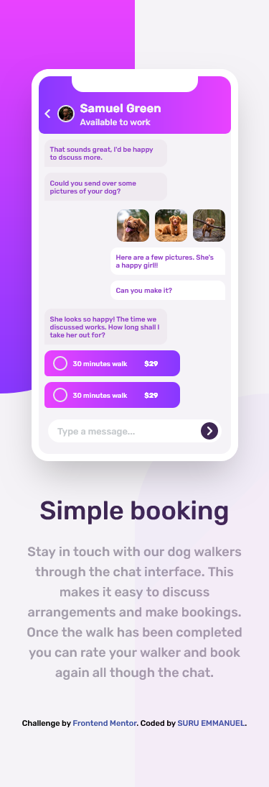

# Frontend Mentor - Chat app CSS illustration solution

This is a solution to the [Chat app CSS illustration challenge on Frontend Mentor](https://www.frontendmentor.io/challenges/chat-app-css-illustration-O5auMkFqY).

## Table of contents

- [Overview](#overview)
  - [Screenshot](#screenshot)
  - [Links](#links)
- [My process](#my-process)
  - [Built with](#built-with)
  - [What I learned](#what-i-learned)
  - [Continued development](#continued-development)
  - [Useful resources](#useful-resources)
- [Author](#author)
- [Acknowledgments](#acknowledgments)

## Overview

### Screenshot

### Links

- Solution URL: [Add solution URL here](https://github.com/suruaino/Challenge7.git)
- Live Site URL: [Add live site URL here](https://suru-chat-app.netlify.app/)

## My process

### Built with
- Semantic HTML5 markup
- CSS custom properties
- Flexbox
- Mobile-first workflow
- Tailwindcss

### What I learned

I improved my skills with css flex property and the use of tailwindcss. 

### Continued development

I will want to keep improving and mastering the use of tailwindcss and vanila.

### Useful resources

- [Tailwindcss Doc](https://tailwindcss.com/) - It is my most used resource. I only used others when a concept is confusing.
- [CHATGPT](https://chat.openai.com/) - This helped me many times when am lost. I really liked it and will will advice those who haven't tried it to please do.

## Author

- SURU EMMANUEL
- Frontend Mentor - [@suruaino](https://www.frontendmentor.io/profile/suruaino)
- Twitter - [@suruaino](https://www.twitter.com/suruaino)

## Acknowledgments

I will want to use this opportunity to thank my lovely sister Ojeifo Loveth and her husband Obende Daniel for their support and encouragement. They kept pushing me right from the day I started this journey till date. They never got tired. I want to say that I really appreciate.
